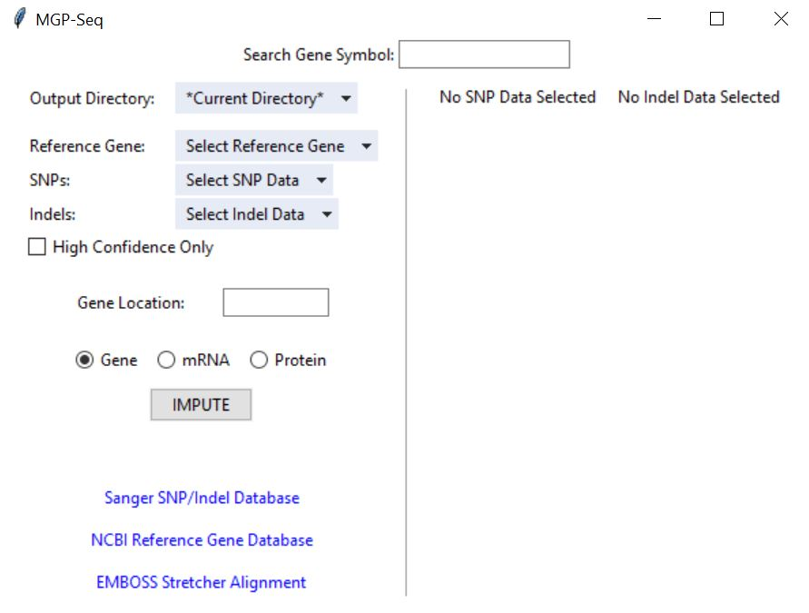
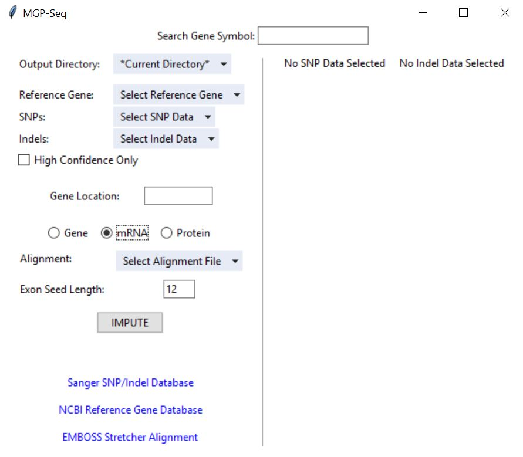
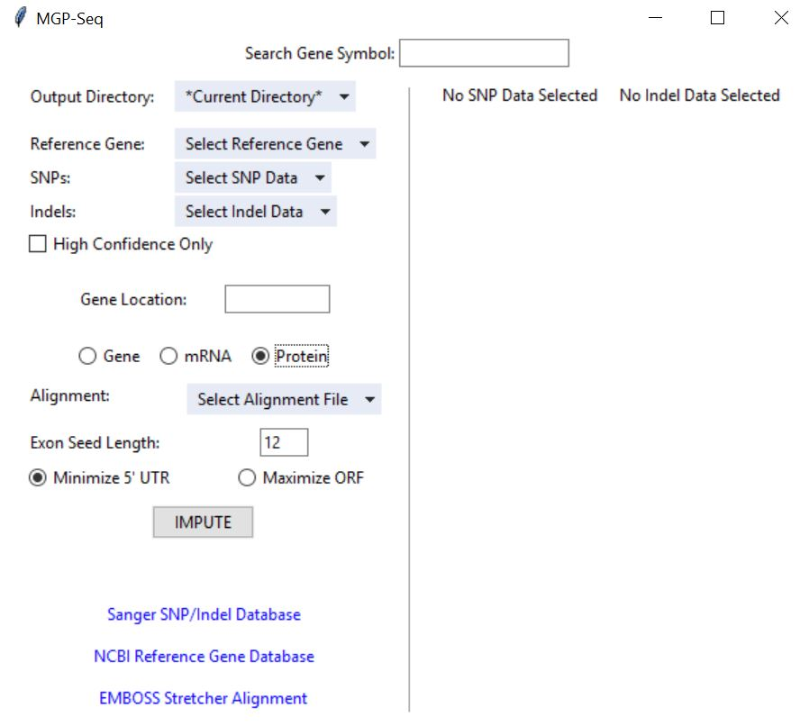

# MGP-Seq
A python application for predicting DNA, RNA, and amino acid sequences for genes in *Mus musculus.*

## Getting Started

### Prerequisites
Download and install Python (<a href="https://www.python.org/downloads/">https://www.python.org/downloads/</a>) to your computer. MGP-Seq is compatible with Python 2 and Python 3. 

#### Additional Prequisites (Python 3 + Mac OSX)
You will have to upgrade *certifi.* There are two options for doing this:
1. Open the terminal and enter ```pip install --upgrade certifi```
2. Run ```Applications/Python 3.6/Install Certificates.command``` either through the terminal or by browsing to file and double-clicking it


### Running MGP-Seq
MGP-Seq.py is the only file that needs to be downloaded from this repository. Python scripts can be run using the steps described <a href="http://www.cs.bu.edu/courses/cs108/guides/runpython.html">here.</a>

## Predicting Sequences

### Gene Sequences
1. Search for your desired gene in the search box at the top of the window and hit Enter
2. Select the output directory. All downloads/exports will direct here
3. Download the Reference Gene, SNPs, and Indels through their respective drop-downs
4. Select the desired strains in the panel on the right
5. Check "High Confidence Only" if you want to exclude SNPs/Indels that are marked as "Low Confidence"
6. Click "Impute"

<p align="center">
  
</p>

### mRNA Sequences
Steps 1-5 are the same as predicting Gene Sequences

6. Download the desired Reference Transcript (Alignment file)
7. Specify an exon seed length for the alignment algorithm. The length should always be a positive integer and is optimally between 10-14. The default length = 12 will work for most cases. If an alignment fails, nudging the seed length to 11 or 13 might fix the problem
8. Click "Impute"

<p align="center">
  
</p>

### Protein Sequences
Steps 1-7 are the same as predicting mRNA Sequences

8. Select which ORF will be translated in the output. *Minimize 5'-UTR* selects the ORF that starts at the very first start codon and ends at the following stop codon. *Maximize ORF* looks at all potential ORFs and translates the longest one. During our testing, *Maximize ORF* was more consistently correct
9. Click "Impute"

<p align="center">
  
</p>

## Working with Local Files
You might want to use files stored locally on your computer rather than files queried from a database. The process is largely the same, but here are some helpful tips:

+ Under each drop-down menu, the "\*Open File Picker\*" option allows you to select local files instead of queried ones. 

+ Homemade SNP/Indel files should follow the following format:

| Chr | Position  | Gene  | dbSNP       | Ref | PWK_PhJ |
| --- | --------  | ----  | ----------- | --- | ------  |
| 12  | 35498379  | Ahr   | rs241381828 | T   | TA      |
| 12  | 35502300  | Ahr   | rs255095624 | AAC | A       |

The first line indicates that at position 35498379, an insertion replaces T in the reference sequence with TA in the PWK_PhJ strain. The second line indicates that at position 35502300, a deletion replaces ACC with A in the same fashion. <i>Position</i> refers to the position in the chromosome of the first base in <i>Ref</i>. The file should be formatted as a Comma Separated Variable file with UTF-8 encoding. The *Gene Location* is subtracted from the Position column to determine the 0-based index in the gene that will be imputed. For example, if the SNP file says that a SNP occurs in position 101, and 100 is entered into the *Gene Location* box, the SNP will occur at the 2nd nucleotide of the reference gene (or the 1st 0-based index).

+ MGP-Seq can parse Reference Gene files in a specific format to automatically identify the starting position of the gene. Homemade Reference Gene files might not follow this format and <b>you will have to type in the the position of the first base into the *Gene Location* box</b>. Alternatively, you can edit your file to follow the header format by specifying the gene sequence range after a colon. An example is given below.
```
>AHR:35497979-35534989
ATTTGGTGGTTAGTTTATTATCATATATCACTGTTTACATTTCCTTTGATATTTAAGGACATTATAAATCATACTT
TAACAAAAATCTATGCATGGCATATGTAAGCAAGTAACAGTTTAAAGGACAGCAAGGAGCTATGTAGACCTAAGAT
CTATTGATACTCAAACTAGCTTGTGCATAGTAACAATTGAAAAGTTGATACACTGGCATATTGGTTAAGTGTTCAG
GTGCTGTAAGAAACACCTAGAAAAGAAGAACTTCAATCAGACATACACAAGAGTCTTAGAATTTCATCTAGAAGTT
AATCCCTCAGTCTAGTGGTGCTCTAAGTGGTCTTTCCATTTGGCACTTGGCAATACAGACAAACAAATAGGCA...
```
+ When the you hit "Impute", whatever text is written in the search box is attached to the end of output filenames. By typing the name of your gene into the search box prior to imputation, you can still allow your outputs to include the gene in their filenames
